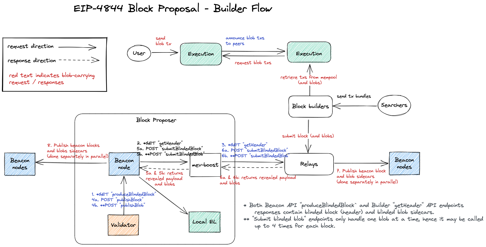
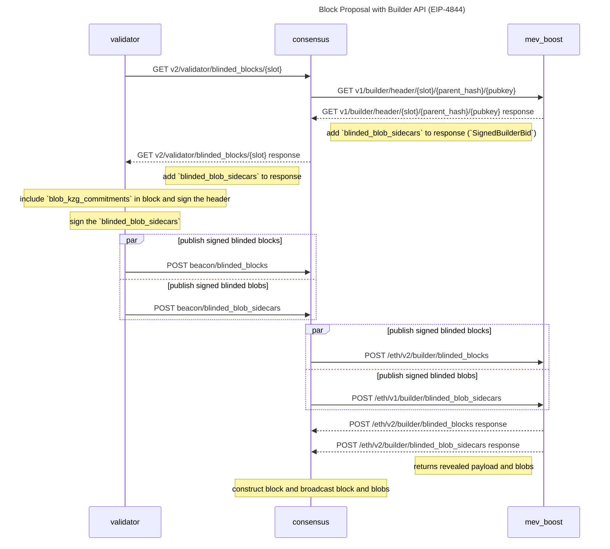

# Block Proposal - Builder flow for EIP-4844

## End-to-end block proposer flow

## Beacon API & Builder API changes

```mermaid
sequenceDiagram
    participant validator
    participant consensus
    participant mev_boost
    Title: Block Proposal with Builder API (EIP-4844)
    validator->>consensus: GET v2/validator/blinded_blocks/{slot}
    consensus->>mev_boost: GET v1/builder/header/{slot}/{parent_hash}/{pubkey}
    mev_boost-->>consensus: GET v1/builder/header/{slot}/{parent_hash}/{pubkey} response
    Note left of mev_boost: add `blinded_blob_sidecars` to response (`SignedBuilderBid`)
    consensus-->>validator: GET v2/validator/blinded_blocks/{slot} response
    Note left of consensus: add `blinded_blob_sidecars` to response
    Note over validator: include `blob_kzg_commitments` in block and sign the header
    Note over validator: sign the `blinded_blob_sidecars`
    par publish signed blinded blocks
        validator->>consensus: POST beacon/blinded_blocks
    and publish signed blinded blobs
        validator->>consensus: POST beacon/blinded_blob_sidecars
    end
    par publish signed blinded blocks
        consensus->>mev_boost: POST /eth/v2/builder/blinded_blocks
    and publish signed blinded blobs
        consensus->>mev_boost: POST /eth/v1/builder/blinded_blob_sidecars
    end
    mev_boost-->>consensus: POST /eth/v2/builder/blinded_blocks response
    mev_boost-->>consensus: POST /eth/v2/builder/blinded_blob_sidecars response
    Note left of mev_boost: returns revealed payload and blobs
    Note over consensus: construct block and broadcast block and blobs
```