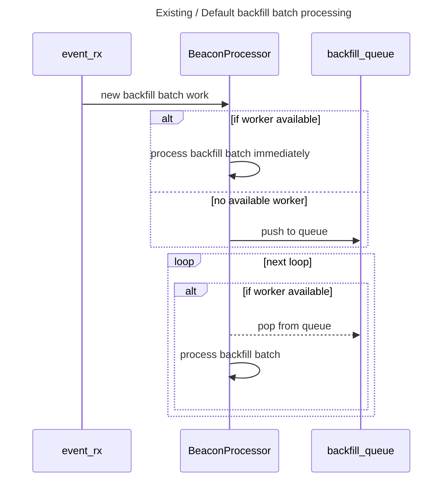
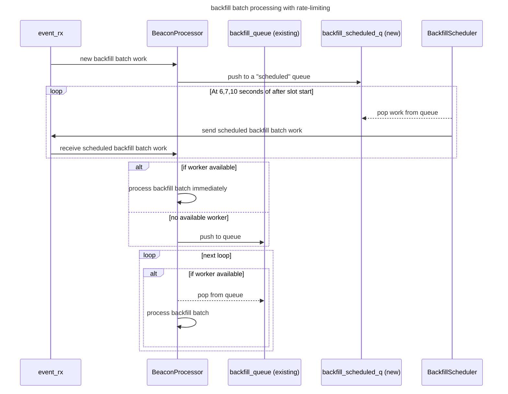

```mermaid
sequenceDiagram
    participant event_rx
    participant BeaconProcessor
    participant backfill_queue
    Title: Existing / Default backfill batch processing
    event_rx->>BeaconProcessor: new backfill batch work
    alt if worker available
        BeaconProcessor->>BeaconProcessor: process backfill batch immediately        
    else no available worker
        BeaconProcessor->>backfill_queue: push to queue
    end
    loop next loop
        alt if worker available
            BeaconProcessor-->>backfill_queue: pop from queue
            BeaconProcessor->>BeaconProcessor: process backfill batch
        end
    end
```

```mermaid
sequenceDiagram
    participant event_rx
    participant BeaconProcessor
    participant backfill_queue as backfill_queue  (existing) 
    participant backfill_scheduled_q as backfill_scheduled_q  (new)
    participant BackfillScheduler
    Title: backfill batch processing with rate-limiting
    event_rx->>BeaconProcessor: new backfill batch work
    BeaconProcessor->>backfill_scheduled_q: push to a "scheduled" queue
    loop At 6,7,10 seconds of after slot start
        BackfillScheduler-->>backfill_scheduled_q: pop work from queue
        BackfillScheduler->>event_rx: send scheduled backfill batch work
        event_rx->>BeaconProcessor: receive scheduled backfill batch work
    end
        alt if worker available
        BeaconProcessor->>BeaconProcessor: process backfill batch immediately        
    else no available worker
        BeaconProcessor->>backfill_queue: push to queue
    end
    loop next loop
        alt if worker available
            BeaconProcessor-->>backfill_queue: pop from queue
            BeaconProcessor->>BeaconProcessor: process backfill batch
        end
    end
```